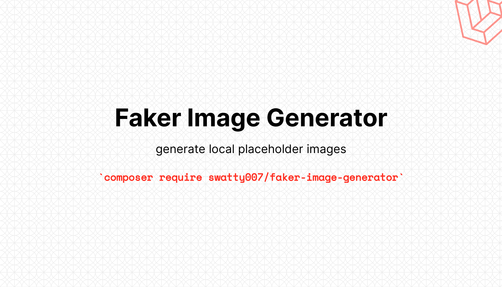
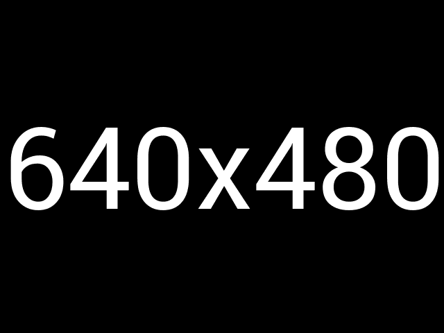
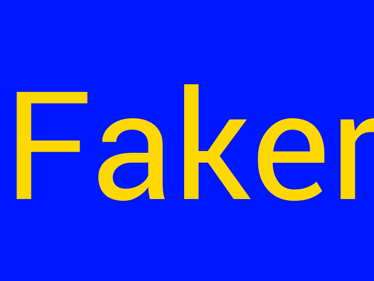

# faker-image-generator



[](https://packagist.org/packages/swatty007/faker-image-generator)
[](https://opensource.org/licenses/MIT)
[](https://www.travis-ci.com/swatty007/faker-image-generator)
[](https://scrutinizer-ci.com/g/swatty007/faker-image-generator)
[](https://packagist.org/packages/swatty007/faker-image-generator)

Generator of placeholder-type images using **GD** for **[fzaninotto/Faker](https://github.com/fzaninotto/Faker)**
to quickly generate fake images within your application or tests, without the need to rely on external services.

> This is a fork from **[bruceheller/images-generator](https://github.com/bruceheller/images-generator)** as that package seems to not be actively maintained anymore.

## Installation

You can install the package via composer:

```bash
composer require swatty007/faker-image-generator
```

## Configuration

After installing the package you can publish the configuration file via:
```php
php artisan vendor:publish --provider="Swatty007\FakerImageGenerator\FakerImageGeneratorServiceProvider"
```
It contains some optional configuration parameters and is fully documented.

> The configuration allows you to define some global image properties which will be shared across all Generator Instances.
> This is an addition to the original package to make is easier to share a similar style throughout your application.

## Usage
Use the `FakerImageGenerationProvider` class in combination with [Faker](https://github.com/fakerphp/faker) to produce new images:

```php
$faker = Factory::create();
$imageGenerator = new FakerImageGenerationProvider($faker);
$image = $faker->imageGenerator();
```

It will generate a black png picture of 640*480 pixels inside your temp directory (if available) 
and return the full path of the picture like this: `'/tmp/13b73edae8443990be1aa8f1a483bc27.png'`.

### Parameters

The `imageGenerator()` method allows you to define rendering options on a per element basis,
those options are identical to your configuration properties and will allow you quickly generate unique images.

## Examples:

```php
$faker->imageGenerator();
```
Will generate a 640x480 black png picture with the text '640x480' in white.



```php
$faker->imageGenerator('img', 640, 480, 'png', true, 'Faker', '#0018ff', '#ffd800');
```
Will generate a 640x480 blue png picture with the text 'Faker' in yellow inside an `img` directory of your project and return the full path such as `'img/f523f8bec6ed65fb1d63ae8d09850f9c.png'` like this:


 

More complex example using the power of [Faker](https://github.com/fzaninotto/Faker):
```php
$faker->imageGenerator('img', $faker->numberBetween(600, 800), $faker->numberBetween(400, 600), 'jpg', true, $faker->word, $faker->hexColor, $faker->hexColor);
```
Will return a jpeg of a random color picture with a width between 600 and 800 pixels, 
height between 400 and 600 pixels, with a random word written in a random color! 

### Testing

``` bash
composer test
```

### Changelog

Please see [CHANGELOG](CHANGELOG.md) for more information what has changed recently.

## TODO
As this is mainly a fork of the existing package, to get it running within modern applications,
its future development plans could apply to this package as well.
However, its current functionality fulfills my needs. Nonetheless, some TODOs remain & are open for pull requests :monocle_face:

- Improve Readme
- Transition to GitHub Actions
- Improve & Extend existing tests!
- Add support for **ImageMagick** and/or **GraphicsMagick** for faster generation of pictures.

Otherwise, any suggestion is welcome! You can fork this project and submit your PR :)

## Contributing

Please see [CONTRIBUTING](CONTRIBUTING.md) for details.

### Security

If you discover any security related issues, please email info@martin-niehoff.de instead of using the issue tracker.

## Credits

- [Martin Niehoff](https://github.com/swatty007)
- [Bruce Heller](https://github.com/bruceheller)
- [All Contributors](../../contributors)

## License

The MIT License (MIT). Please see [License File](LICENSE.md) for more information.

The **[Roboto](https://github.com/google/roboto)** font file included in this project is under Apache Licence 2.0 as mentioned on the [Roboto](https://github.com/google/roboto) repository.
